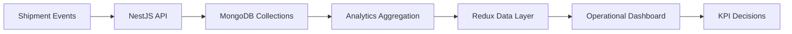
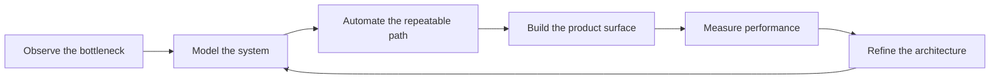
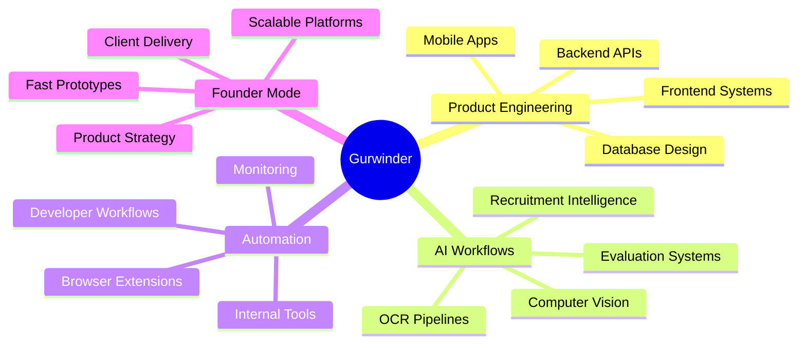

<!--
  GitHub Profile README for Gurwinder Singh
  Replace placeholders marked with TODO before publishing:
  - YOUR_TWITTER_OR_X_URL
  - YOUR_CALENDLY_URL
-->

<div align="center">


<a href="https://github.com/Gurwinder7735">
  
</a>

<br />


</div>

---

<table>
<tr>
<td width="60%" valign="top">

### Building Systems, Not Just Apps

I am **Gurwinder Singh**, a senior frontend engineer and full stack product builder focused on the place where sharp interfaces meet serious architecture.

I build production systems for hiring, assessments, automation, internal tooling, mobile workflows, browser extensions, real-time monitoring, AI-assisted operations, and product experiments that need to move from idea to usable software fast.

My operating style is simple: understand the system, remove waste, automate the repeatable parts, and ship interfaces that feel fast because the architecture underneath is disciplined.

</td>
<td width="40%" valign="top">

```txt
gurwinder@github
-------------------------------
role       Senior Frontend Engineer
mode       Full Stack Product Builder
focus      AI x Automation x UX
edge       speed, systems, execution
stack      React, Node, Mongo, SQL
runtime    founder energy
```

</td>
</tr>
</table>

---

## Current Signal

<div align="center">

| Building | Exploring | Optimizing |
| --- | --- | --- |
| AI recruitment systems | OCR + Computer Vision workflows | Frontend performance |
| Product automation systems | AI construction automation | Monitoring architecture |
| Internal developer tooling | Browser automation | Product delivery speed |
| Web and mobile platforms | AI-integrated workflows | Scalable system design |

</div>

---

## Systems I Build

<table>
<tr>
<td width="50%" valign="top">

### ZEUS

AI-powered recruitment infrastructure designed to reduce hiring noise and improve evaluation quality.

```txt
scope:
  - candidate intelligence
  - assessment workflows
  - monitoring systems
  - anti-cheating concepts
  - evaluation automation
```

</td>
<td width="50%" valign="top">

### Salon Platform

Large salon ecosystem with booking, management, operational workflows, and international product ambition.

```txt
scope:
  - bookings
  - operations
  - staff workflows
  - business management
  - scalable product modules
```

</td>
</tr>
<tr>
<td width="50%" valign="top">

### AI Construction Vision

Exploring automation systems for construction workflows using OCR, computer vision, AI extraction, and operational intelligence.

```txt
scope:
  - document intelligence
  - OCR workflows
  - computer vision
  - process automation
  - AI-assisted operations
```

</td>
<td width="50%" valign="top">

### Internal Automation

Tools and workflows built to reduce repeated manual effort across engineering, operations, and product execution.

```txt
scope:
  - browser extensions
  - internal dashboards
  - developer tooling
  - workflow automation
  - real-time product surfaces
```

</td>
</tr>
</table>

---

## Featured Projects

<div align="center">


<br />
<br />

<strong>Selected builds across logistics, intelligence dashboards, browser automation, and business networking.</strong>

<br />
<sub>Designed as product systems: interface, workflow, data model, automation, operations, and business outcome.</sub>

</div>

<br />

<details open>
<summary><strong>Marineair Cargo Services</strong> — Instant Shipping Quotes Tool</summary>

<br />

<table>
<tr>
<td width="56%" valign="top">


</td>
<td width="44%" valign="top">

### Enterprise SaaS Logistics Platform

Instant quotation and shipment management for cargo operations.


```txt
impact:
  shipping quote flow moved from manual back-and-forth
  to structured, instant, operationally visible workflows
```

</td>
</tr>
</table>

<table>
<tr>
<td width="33%" valign="top">

#### Key Features

- Instant shipping quotation generation
- Booking management
- Shipment workflow handling
- Admin management panel
- Responsive dashboard UI
- Real-time shipment operations

</td>
<td width="33%" valign="top">

#### Engineering Challenges

- Dynamic quotation rules with multiple input paths
- Complex form state across shipment details
- Admin workflows that needed speed and clarity
- API design for operational data consistency
- Responsive UX for dense logistics screens

</td>
<td width="33%" valign="top">

#### System Thinking

```txt
quote request
  -> validation layer
  -> pricing workflow
  -> booking record
  -> admin operations
  -> shipment lifecycle
```

</td>
</tr>
</table>

```bash
$ deploy marineair-quotes
building quotation engine... done
optimizing admin workflows... done
shipping operations dashboard... online
```

**Business impact:** reduced manual quotation friction, gave operators a cleaner booking workflow, and made shipment handling more trackable from a single management surface.

**Performance and automation improvements:** reusable form architecture, optimized admin flows, structured API boundaries, and faster quote-to-booking execution.

</details>

---

<details open>
<summary><strong>M3 Logistics</strong> — Logistics Management Intelligence Dashboard</summary>

<br />

<table>
<tr>
<td width="42%" valign="top">

### Operations Intelligence Platform

Data-heavy logistics management built for tracking, analytics, reporting, and operational visibility.


```txt
mission:
  convert logistics activity into dashboards,
  signals, reports, and decisions operators can trust
```

</td>
<td width="58%" valign="top">


</td>
</tr>
</table>

<table>
<tr>
<td width="50%" valign="top">

#### Intelligence Layer

- Real-time analytics dashboards
- Shipment tracking
- Inventory management
- Reporting systems
- KPI monitoring
- Performance visualization
- Operational insights

</td>
<td width="50%" valign="top">

#### What Made It Difficult

The hard part was not just drawing charts. It was shaping noisy logistics data into a responsive enterprise UI where operators can scan, compare, filter, and act without waiting on heavy renders or unclear state transitions.

</td>
</tr>
</table>



**Architecture focus:** scalable analytics architecture, predictable state management, dashboard composition, and data visualization patterns that keep dense information readable.

**Business impact:** improved operational visibility, supported faster logistics decisions, and created a single intelligence surface for tracking, inventory, reports, and performance monitoring.

**Performance and automation improvements:** optimized dashboard rendering, structured data flow, reusable visualization modules, and reduced manual reporting effort.

</details>

---

<details>
<summary><strong>PinSpy</strong> — Pinterest Chrome Extension & Scraping System</summary>

<br />

<table>
<tr>
<td width="50%" valign="top">


</td>
<td width="50%" valign="top">

```txt
PINSPY / browser automation lab
--------------------------------
target      Pinterest ad exploration
surface     Chrome extension
engine      Puppeteer + extraction workflows
focus       scraping, lazy loading, DOM signals
challenge   dynamic content at browser speed
```


</td>
</tr>
</table>

#### Automation Aesthetic

<table>
<tr>
<td width="25%" valign="top">

**Extract**

Dynamic content, ad surfaces, interaction states, lazy-loaded data.

</td>
<td width="25%" valign="top">

**Analyze**

Normalize scraped signals into useful exploration flows.

</td>
<td width="25%" valign="top">

**Enhance**

Improve browsing with extension-driven overlays and actions.

</td>
<td width="25%" valign="top">

**Optimize**

Reduce DOM scanning cost and keep rendering responsive.

</td>
</tr>
</table>

```bash
$ pinspy scan --source=pinterest --mode=ads
attaching browser context... ok
waiting for lazy content... ok
extracting dynamic nodes... ok
normalizing ad signals... ok
extension interface ready
```

**Engineering challenges solved:** Chrome extension architecture, dynamic DOM extraction, Puppeteer automation, lazy loading optimization, interactive browsing enhancements, and performance-focused rendering.

**Business impact:** enabled faster Pinterest ad exploration and reduced repetitive manual research through a browser-native automation workflow.

**Performance and automation improvements:** optimized scraping loops, improved lazy-load handling, separated browser automation concerns, and made extraction workflows more repeatable.

</details>

---

<details>
<summary><strong>Putiton</strong> — Business Networking Platform</summary>

<br />

<table>
<tr>
<td width="46%" valign="top">

### Modern Startup Networking Surface

A professional networking product where members create profiles, discover people, collaborate, and move through a business ecosystem with a clean responsive interface.


</td>
<td width="54%" valign="top">


</td>
</tr>
</table>

<table>
<tr>
<td width="33%" valign="top">

#### Product Core

- Authentication system
- Professional profiles
- Networking interactions
- Collaboration workflows
- Member discovery
- Modern responsive frontend

</td>
<td width="33%" valign="top">

#### Architecture Notes

- Scalable frontend structure
- Profile-centric data modeling
- Secure authentication flow
- Responsive page composition
- UX paths for discovery and engagement

</td>
<td width="33%" valign="top">

#### Build Difficulty

The platform needed to feel social without becoming noisy: identity, trust, discovery, and collaboration all had to work together inside a clean startup-grade product experience.

</td>
</tr>
</table>

```txt
networking loop:
  create identity
  -> discover members
  -> inspect professional context
  -> start interaction
  -> collaborate
  -> return with stronger network value
```

**Business impact:** created a foundation for a modern professional ecosystem with user profiles, discovery, collaboration, and repeat engagement loops.

**Performance and automation improvements:** optimized UX flows, responsive component structure, reusable profile modules, and cleaner auth-driven navigation.

</details>

---

## Engineering Philosophy



I like engineering that compounds. A good tool saves time once. A great system keeps saving time even when the team, product, and complexity grow.

What I care about:

- Interfaces that stay fast under real product pressure.
- Automation that removes boring work without hiding important context.
- Backend design that supports the frontend instead of fighting it.
- Systems that can be explained clearly, debugged sanely, and extended without drama.
- Product decisions that respect users, operators, and the business model.

---

## Tech Arsenal

<div align="center">

### Frontend


### Backend, Data, Runtime


### Tools, Platforms, Workflow


</div>

<br />

<div align="center">


</div>

---

## Product Builder DNA

<table>
<tr>
<td width="33%" valign="top">

### Performance

I treat speed as a product feature. Rendering cost, network shape, state boundaries, bundle weight, perceived latency, and data flow all matter.

</td>
<td width="33%" valign="top">

### Automation

If a workflow is repeated often enough, I start looking for the machine inside it. Scripts, dashboards, extensions, AI flows, internal tools.

</td>
<td width="33%" valign="top">

### Architecture

I like systems where the frontend, backend, database, and operational workflows are designed as one product organism.

</td>
</tr>
</table>

---

## Things I Automate

```txt
manual hiring loops        -> AI-assisted evaluation workflows
candidate uncertainty      -> monitoring + signal collection
repetitive internal tasks   -> tools, scripts, dashboards
slow review cycles          -> structured assessment systems
browser-heavy operations    -> extensions and workflow automation
unstructured documents      -> OCR + AI extraction pipelines
```

---

## AI x Product Engineering

I am especially interested in AI that becomes part of the product workflow instead of sitting on top as a feature label.

```txt
AI layer:
  input      documents, activity, video, screens, events, user intent
  process    extraction, scoring, detection, summarization, routing
  output     decisions, dashboards, workflows, alerts, recommendations

product rule:
  keep the human in control
  make the system explainable
  make the interface fast enough to trust
```

---

## GitHub Telemetry

<div align="center">


<br />
<br />


<br />
<br />


</div>

---

## Execution Map



---

## Terminal

```bash
$ whoami
Gurwinder Singh

$ current_focus
AI recruitment infrastructure, automation systems,
automation tooling, scalable web/mobile products

$ engineering_bias
ship fast, measure honestly, simplify aggressively, automate the boring parts

$ looking_for
ambitious products, sharp teams, complex systems, and people building for real users
```

---

## Collaboration Surface

I am useful when the problem is messy, the deadline is real, and the product needs someone who can move across frontend, backend, architecture, and execution without waiting for perfect instructions.

Good reasons to talk:

- You are building an AI-enabled SaaS product.
- You need a senior frontend engineer who understands systems.
- You want to turn a manual business workflow into software.
- You are designing internal tools, hiring platforms, automation systems, or real-time dashboards.
- You need a product builder who can think like an engineer and a founder in the same conversation.

---

## Connect

<div align="center">

<a href="https://gurwinder-theta.vercel.app/">
  
</a>

<a href="https://www.linkedin.com/in/gurwinder7735/">
  
</a>

<a href="mailto:gurwinder7735@gmail.com">
  
</a>

<!-- TODO: Replace YOUR_TWITTER_OR_X_URL with your X/Twitter URL, or remove this block -->
<a href="YOUR_TWITTER_OR_X_URL">
  
</a>

<!-- TODO: Replace YOUR_CALENDLY_URL with your booking link, or remove this block -->
<a href="YOUR_CALENDLY_URL">
  
</a>

</div>

---

## Contribution Flow

<div align="center">

<!--
  Optional contribution snake setup:
  1. Add the GitHub Action from Platane/snk.
  2. Generate dist/github-contribution-grid-snake-dark.svg.
  3. Keep the image path below.
-->

<picture>
  <source media="(prefers-color-scheme: dark)" srcset="https://raw.githubusercontent.com/Gurwinder7735/Gurwinder7735/output/github-contribution-grid-snake-dark.svg" />
  <source media="(prefers-color-scheme: light)" srcset="https://raw.githubusercontent.com/Gurwinder7735/Gurwinder7735/output/github-contribution-grid-snake.svg" />
  
</picture>

</div>

---

<div align="center">


<br />

<strong>Systems. Speed. Product instinct. Founder execution.</strong>

<br />
<br />

<sub>Built for people who care about what software can remove, accelerate, and make possible.</sub>

</div>

---

## Optional Enhancements

<!--
  These upgrades can make the profile even stronger:

  1. Create a /assets folder with a custom animated SVG or generated banner.
  2. Add a pinned-project section with real repository links and screenshots.
  3. Enable the contribution snake GitHub Action.
  4. Add a WakaTime card if you use WakaTime.
  5. Replace placeholder contact links with real URLs.
  6. Add case-study links for ZEUS, the Salon Platform, and AI construction workflows when public.
  7. Add a short demo GIF for any production product that can be shown safely.
-->
